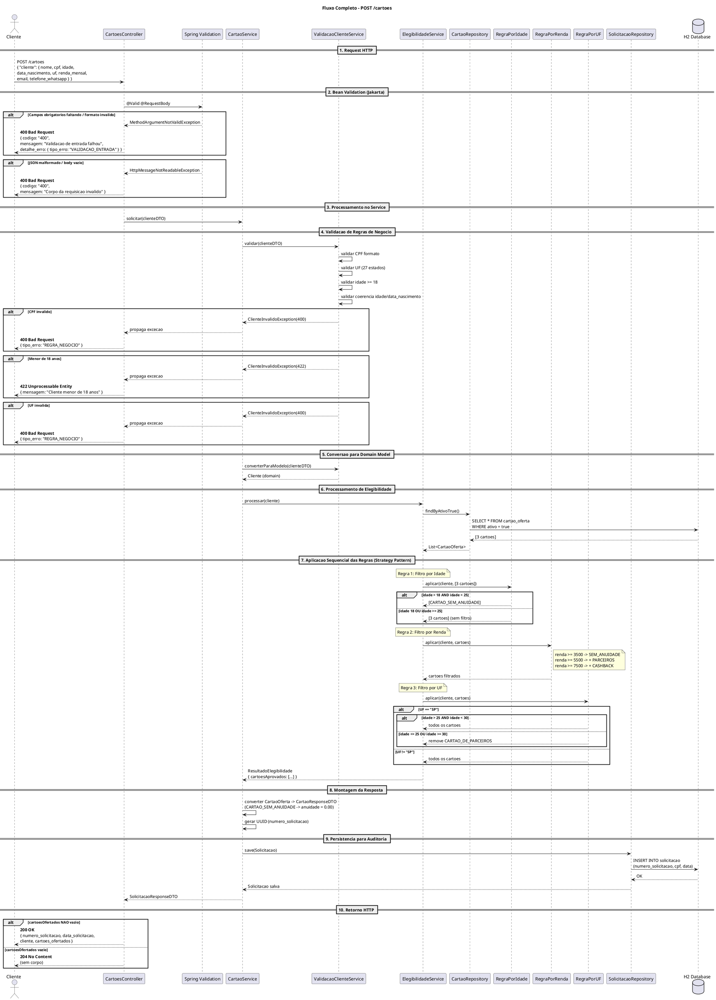
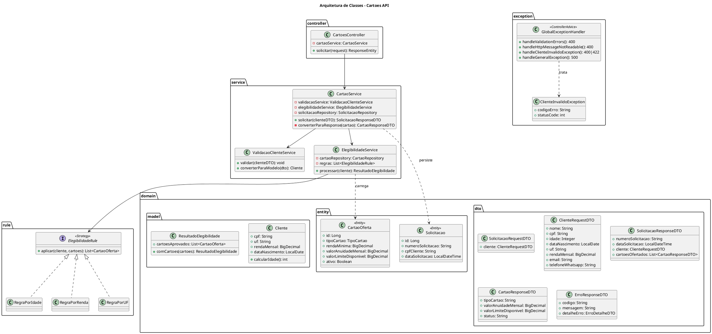

# Arquitetura do Projeto

Documentacao visual do fluxo e estrutura da API de Cartoes.

---

## Diagrama de Sequencia - Fluxo Completo `POST /cartoes`

Este diagrama mostra o caminho completo de uma requisicao, desde a chegada no controller ate o retorno HTTP (200, 204, 400, 422, 500).

---

## Diagrama de Classes - Arquitetura

Mostra a estrutura de pacotes, classes e seus relacionamentos.

---

## Como Visualizar os Diagramas

Os diagramas acima estao em formato [PlantUML](https://plantuml.com/). Para visualiza-los:

1. **Online**: Copie o codigo entre `@startuml` e `@enduml` e cole em [plantuml.com](https://www.plantuml.com/plantuml/uml)
2. **VS Code**: Instale a extensao "PlantUML" e use `Alt+D` para preview
3. **IntelliJ**: Instale o plugin "PlantUML Integration"

---

## Resumo dos Status HTTP

| Codigo | Quando | Quem Decide |
|--------|--------|-------------|
| **200 OK** | Cliente tem pelo menos 1 cartao aprovado | `CartoesController` |
| **204 No Content** | Nenhum cartao elegivel apos aplicar regras | `CartoesController` |
| **400 Bad Request** | JSON invalido, campos faltando, formato errado | `GlobalExceptionHandler` |
| **422 Unprocessable Entity** | Regra de negocio violada (ex: menor de 18) | `GlobalExceptionHandler` |
| **500 Internal Server Error** | Erro inesperado na aplicacao | `GlobalExceptionHandler` |
